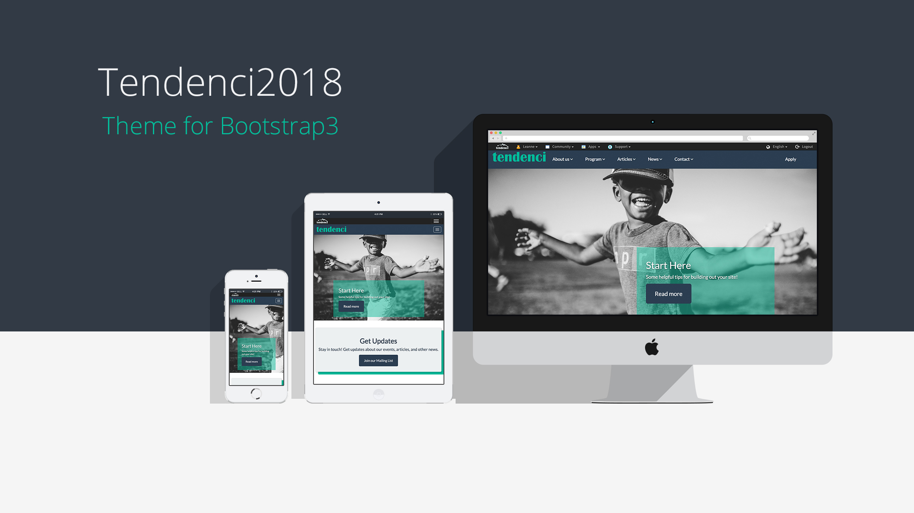

# Tendenci2020 — Tendenci Base Theme
One base starter theme for a Tendenci site. This theme is a fully responsive, completely customizable Bootstrap theme for Tendenci.

## Getting Started

If you're running Tendenci on your own local machine, feel free to clone or fork the repo. To make changes from Tendenci's browser-based Theme Editor, you can copy and paste templates. Please note that css changes currently on your site may affect the css in this template.

## Using Bootstrap 3
[Bootstrap](https://getbootstrap.com/) built-ins are used to create the foundation for most of the Tendenci modules in the theme.  Using Bootstrap 3 makes it possible to implement site-wide design changes instantly.  The Bootswatch CDN is used in this theme and can be removed to reveal simple Bootstrap classic templates.  Other themes from [Bootswatch](https://bootswatch.com/) can also be used by changing the Bootswatch CDN in the 'base.html' file.

To add customizations on select pages, add your own unique class or id to prevent affecting the Bootstrap built-ins in other modules.

### Examples of [Bootswatch](https://bootswatch.com/) Themes on Tendenci

### Implementing Bootswatch for Tendenci
Navigate to "base.html" in your Theme Editor.

In the Bootswatch CDN link, you can change only the name of the theme to toggle through the different options!  See the image below for directions.  In this example, the 'paper' theme is used.  You can change this to any of the other [Bootswatch](https://bootswatch.com/) theme names to completely change the look of your site. 

### Highly utilized Built-ins
When updating the css in your site be mindful that these classes are implemented frequently in this base-theme.  Changes to the classes associated will be site-wide!
* Panels
* Navs
* Wells
* Buttons
* Page-headers
* Responsive Tables
* Responsive Images

## Features
### Masonry
This theme also uses Masonry in the Photos and Videos modules.  It can be easily applied anywhere else there are variable sized grids.

 

## Icons
Icon sets in this theme are:
* [Font Awesome](http://fontawesome.io/)
* [Material Design Iconic Font](http://zavoloklom.github.io/material-design-iconic-font/icons.html)

## Creator
This template was created by [Tendenci](https://tendenci.com)!
* [Twitter](https://twitter.com/tendenci)
* [Facebook](https://facebook.com/tendenci)
* [YouTube](https://youtube.com/tendencicms)
* [Github](https://github.com/tendenci)

## Bugs and Issues
Having an issue with this template?  Please submit here on [Tendenci's Github](https://github.com/tendenci/tendenci/issues).

## Copyright and License
Copyright Tendenci — The Open Source AMS, 2017 under the GPU license.

Images are from [Pexels](https://pexels.com) or by [Ed Schipul](https://www.tendenci.com/photos/set/latest/?q=stock) under CC0.

*For more tips and tricks, visit our Read the Docs!
https://tendenci.readthedocs.io/en/latest/*
